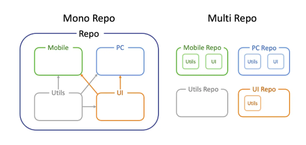

## issue

사이드 플젝을 하며, 모노레포/멀티레포에 대한 얘기를 나눴는데 정확히 알고 있으면 좋을 것 같아서 정리하게 되었다.
  

## content

**💡 요약**  
**모노레포**는 두 개 이상의 프로젝트 코드가 동일한 저장소에 저장되는 소프트웨어 개발 전략임. 
**멀티레포**는 프로젝트별로 저장소를 만드는 방식.

### 모노레포

**장점**

- 공유 라이브러리: 여러 프로젝트에서 공유되는 라이브러리를 관리하는 데 적합함.
- 단일 버전 관리: 모든 코드가 하나의 버전 관리 체계에서 관리되기 때문에, 버전 충돌 문제를 최소화할 수 있음.
- 코드 리뷰 향상: 각 플젝의 작업 사항을 하나의 저장소에서 확인할 수 있기 때문에, 자연스럽게 다른 플젝 코드를 들여다보면서 코드 리뷰에 적극적으로 참여할 수 있게 된다.
   

**단점**

- 개발환경 구성의 어려움: 여러 플젝과 의존성을 모두 관리하는 것은 복잡성이 높기 때문에 러닝커브가 있다.
- 배포 복잡성: 모든 코드가 하나의 저장소에서 관리되기 때문에, 배포 프로세스가 더 복잡해질 수 있다.

  

### 멀티레포

**장점**

- 더 나은 협업: 각각의 저장소는 작은 단위로 관리되기 때문에, 여러 개발자들이 동시에 작업할 때 충돌을 최소화할 수 있음
- 배포: 멀티레포는 전체 플젝을 빌드하거나 배포할 필요 없이 일부분만 변경하거나 배포할 수 있다.
   

**단점**

- 관리 복잡성: 저장소의 수가 많아질수록 관리가 복잡해진다. 각 저장소에 대한 버전 및 의존성 관리가 필요함.
- 코드 컨벤션의 어려움: 각 플젝의 코드 컨벤션을 통일하기 어렵다.
- 오랫동안 건드리지 않은 플젝의 관리가 힘들어지며, 시간이 지날수록 해당 플젝의 legacy 파악이 어려워질 수 있다.

 

## 🧷 참조

- [모노레포 vs 멀티레포](https://velog.io/@miso1489/%EB%AA%A8%EB%85%B8%EB%A0%88%ED%8F%AC%EC%99%80-%EB%A9%80%ED%8B%B0%EB%A0%88%ED%8F%AC)
