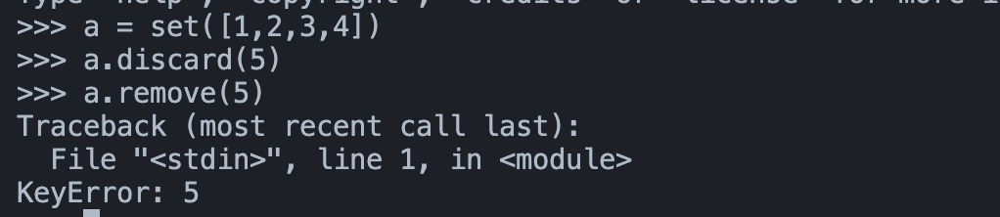

## issue

[백준 11723번](https://www.acmicpc.net/problem/11723) 문제를 풀다가 set에서 remove시에 에러가 안나게 하는건 없나..싶어서 찾아보게 되었다.
<br/><br/>

## content

**💡 요약** <br/>
discard 함수는 존재하지 않는 수를 제거할때, 오류가 발생하지 않는다.

remove와 discard 모두 특정 엘리먼트를 삭제하는 메소드이다.<br/>

- remove는 존재하지 않는 원소를 지우려고 할 때, KeyError가 발생한다.
- discard는 존재하지 않는 원소를 지우려고 할 때, 정상 종료한다.

```python
a = set([1,2,3,4])
a.discard(5) # 정상 종료
a.remove(5) # KeyError 발생
```


